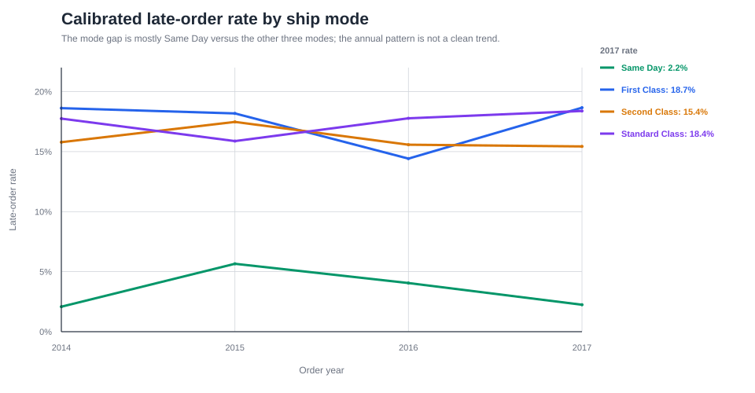
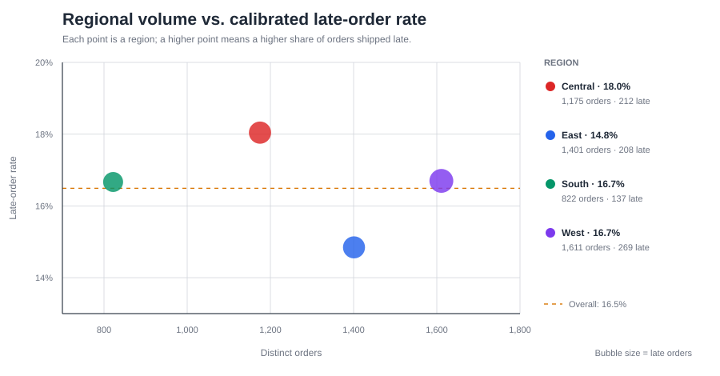
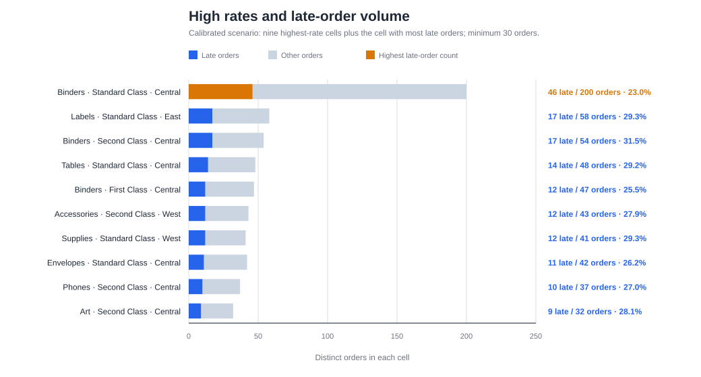

# Superstore Fulfillment SLA Analysis

> How does time to ship vary by service mode, and where should an operations review begin?

This project uses a CSV version of [Tableau's fictional Sample Superstore dataset](https://public.tableau.com/app/resources/sample-data) to analyze the time between order placement and shipment. The source has no promised ship or delivery date. It therefore uses documented, ship-mode-specific thresholds to classify orders and tests how sensitive the results are to those thresholds.

## Dataset at a glance

The tracked archive contains 9,994 product-line records for 5,009 orders placed from 2014 through 2017. Each line includes order and ship dates, ship mode, customer segment, location, product category and subcategory, quantity, sales, discount, and profit. An order may contain multiple lines, so shipment performance is measured at order grain.

## SLA assumptions

The analysis uses business days between order and ship date. The order date is excluded, the ship date is included, and observed federal holidays are excluded. A shipment is successful when its business-day count is less than or equal to the applicable threshold.

The four modeled threshold sets are in business days:

| Scenario | Same Day | First Class | Second Class | Standard Class | Role |
|---|---:|---:|---:|---:|---|
| Initial benchmark | 0 | 1 | 2 | 5 | Original working assumption |
| Calibrated | 0 | 2 | 3 | 4 | Exploratory comparison based on the observed distribution |
| Strict | 0 | 1 | 2 | 3 | One day less than calibrated for non-Same-Day modes |
| Lenient | 0 | 3 | 4 | 5 | One day more than calibrated for non-Same-Day modes |

The calibrated thresholds were chosen after examining this dataset, so they are useful for comparing patterns within it, not for grading performance against an independent promise. Strict and lenient are symmetric one-day sensitivity cases around calibrated; Same Day stays at zero. The initial benchmark preserves the original working assumption.

## Headline result

Under the calibrated `0/2/3/4` scenario, 826 of 5,009 orders are classified as late (16.5%).

| Ship mode | Orders | Late orders | Late-order rate |
|---|---:|---:|---:|
| Same Day | 264 | 9 | 3.4% |
| First Class | 787 | 137 | 17.4% |
| Second Class | 964 | 154 | 16.0% |
| Standard Class | 2,994 | 526 | 17.6% |

The overall classified-late rate ranges from 0.7% under lenient to 47.2% under strict; the initial benchmark produces 15.2%. The wide range reflects the observed clustering of shipment times around the chosen thresholds. These are modeled time-to-ship comparisons, not contractual SLA results.

## What the analysis shows

The three non-Same-Day modes fall into a similar range under the calibrated scenario. This similarity is descriptive because the thresholds were chosen using these data. Same Day has a lower classified-late rate and a smaller sample.



The regional view adds useful context. East has the lowest calibrated late rate at 14.8% despite having the second-highest order volume. West carries the largest workload at 1,611 orders but is close to the overall rate at 16.7%. Central has the highest rate at 18.0% despite having fewer orders than East or West. The data does not support a simple conclusion that more volume automatically produces worse performance.



The product chart places the nine highest-rate subcategory × ship mode × region cells beside the cell with the most classified-late orders. Central × Standard Class × Binders has 46 classified-late orders out of 200 (23.0%): more late orders than the smaller, higher-rate cells. Bar length shows the order count, so the denominator remains visible.



## What is included

- A validated Python transformation that profiles the source, preserves order-line grain, and creates a one-row-per-order SLA fact.
- Holiday-aware business-day logic that excludes the order date and includes the ship date.
- Four explicit SLA scenarios: initial benchmark, calibrated, strict, and lenient.
- A reporting star schema with date, customer, location, product, and ship-mode dimensions.
- A PostgreSQL reproduction that preserves both fact-table grains, aggregates financials to order grain, produces four summary families, and reconciles to Python.
- Automated tests for source quality, dates, grain, keys, SLA logic, and star-schema integrity.

## Reproduce the analysis

From the repository root, run these commands in order. The tracked archive is the portable source; the extracted CSV and processed outputs remain local ignored files.

```powershell
py -m venv .venv
.\.venv\Scripts\python.exe -m pip install -r requirements.txt
if (-not (Test-Path 'data/raw/Sample - Superstore.csv')) {
    Expand-Archive -LiteralPath 'data/raw/superstore_dataset.zip' -DestinationPath 'data/raw'
}
.\.venv\Scripts\python.exe -m pytest -q
.\.venv\Scripts\python.exe -m scripts.transform_superstore
.\.venv\Scripts\python.exe -m scripts.analyze_sla
.\.venv\Scripts\python.exe scripts\create_portfolio_charts.py
```

To reproduce the SQL summaries, install PostgreSQL and create a local database named `portfolio_sla`. Connect with a role that can create temporary tables; for a default `postgres` role, run `psql -U postgres -d portfolio_sla -f sql\fulfillment_sla_analysis.sql`. Substitute your local role if it differs. The SQL script uses temporary tables and ends with `ROLLBACK`; it does not create persistent database objects.

## Documentation

- [Findings memo](findings-memo.md): business findings, operational interpretation, recommendations, and limitations.
- [Technical defense](technical-defense.md): data quality, grain, joins, Python and SQL responsibilities, validation, and interview-level explanations.
- [Analysis appendix](analysis-notes.md): detailed definitions, calculations, cross-tab methodology, and interpretation limits.
- [Data model notes](data-model-notes.md): fact grains, keys, joins, dimensions, and modeling constraints.
- [PostgreSQL reproduction notes](sql/README.md): what the SQL proves and how it reconciles to Python.

## Repository map

- `scripts/transform_superstore.py`: source validation, business-day logic, facts, and star schema.
- `scripts/analyze_sla.py`: scenario analysis and Python summaries.
- `scripts/create_portfolio_charts.py`: reproducible SVG charts for the written findings.
- `sql/fulfillment_sla_analysis.sql`: PostgreSQL reproduction and reconciliation.
- `docs/assets/`: tracked charts used in the portfolio documents.
- `tests/`: automated validation and regression coverage.

## Data and publication scope

This public repository contains the project documentation, source code, tests, tracked Superstore archive, and chart assets. The extracted CSV and processed outputs are local ignored artifacts. Internal status, handoff, and planning notes are kept in a separate private companion repository under `.private/`, which this repository ignores.

The analysis measures time to shipment, not arrival to the customer. Without an observed promise field, the late flags depend on modeled thresholds. The data does not establish causal financial loss, customer harm, or contractual noncompliance.
